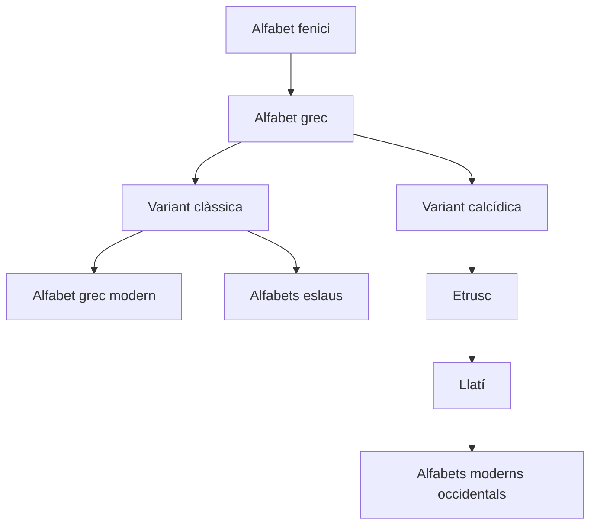

# Tema 1: L’alfabet grec

## 📜 Origen

> *"Los egipcios fueron los primeros, en expresar con figuras de animales...,  
los pensamientos y consideraban que fueron ellos los inventores del alfabeto.  
De allí, dicen, los fenicios, como dominaban el mar, lo llevaron a Grecia…"*  
> — **Tàcit**, *Anales*, XI, 14.

---

## 📘 De l’alfabet fenici al grec

L’alfabet grec prové de l’alfabet **fenici**, com es pot veure en l’ordre i nom de les lletres. Aquest es va introduir a Grècia durant la primera meitat del **segle IX aC**, quan els grecs entraren en contacte amb aquest poble comerciant del Mediterrani.

Els **fenicis** usaven un sistema gràfic basat en símbols més senzills que els jeroglífics egipcis. Com que el seu alfabet **no tenia vocals**, els grecs van haver d’introduir lletres addicionals per representar-les. Així van crear un **alfabet fonemàtic**, amb dues variants principals: la **clàssica** i la **calcídica**.

> ✍️ El nou sistema creat pels grecs constava només de **majúscules**. Les **minúscules** aparegueren molt més tard, a l’època **bizantina** (segle VIII dC). Les majúscules estaven pensades per facilitar la còpia i lectura dels textos antics.

---

## 🔤 Taula comparativa

| **Fenici** | **Nom**   | **Grec** | **Nom**     |
|------------|-----------|----------|-------------|
| 𐤀         | aleph     | Α        | alfa        |
| 𐤁         | beth      | Β        | beta        |
| 𐤂         | gimel     | Γ        | gamma       |
| 𐤃         | daleth    | Δ        | delta       |
| 𐤄         | he        | Ε        | épsilon     |
| 𐤅         | waw       | Ϝ / Υ    | dígamma / ýpsilon |
| 𐤆         | zayin     | Ζ        | dzeta       |
| 𐤇         | heth      | Η        | eta         |
| 𐤈         | teth      | Θ        | theta       |
| 𐤉         | yod       | Ι        | iota        |
| 𐤊         | kaph      | Κ        | kappa       |
| 𐤋         | lamed     | Λ        | lambda      |
| 𐤌         | mem       | Μ        | mu          |
| 𐤍         | nun       | Ν        | nu          |
| 𐤎         | samekh    | Ξ        | xi          |
| 𐤏         | ayin      | Ο        | òmicron     |
| 𐤐         | pe        | Π        | pi          |
| 𐤑         | tsade     | Ψ        | psi         |
| 𐤒         | qoph      | Ϙ        | qoppa       |
| 𐤓         | resh      | Ρ        | rho         |
| 𐤔         | shin      | Σ        | sigma       |
| 𐤕         | taw       | Τ        | tau         |
| —          | —         | Χ        | khi         |
| —          | —         | Φ        | phi         |
| —          | —         | Ω        | omega       |

---

## 🧠 Tipus d’escriptura

- ✴️ **Escriptura ideogràfica**
- ✴️ **Alfabet sil·làbic**
- ✴️ **Alfabet fonemàtic** (el grec)

---

## ✨ Curiositats

> **CURIOSITATS**  
> Algunes lletres gregues antigues es van descartar per no representar cap so. En canvi, es van mantindre per a ús **numèric**.  
> Per exemple, **Ϙ koppa** servia per indicar el nombre **90**.  
>
> Els **llatins** van recuperar algunes d’aquestes lletres per al seu alfabet. Així, la nostra **F** prové del **dígamma (Ϝ)** i la **Q** de la **koppa (Ϙ)**.

---

## 🏛️ Del grec al llatí i a altres alfabets

L’**alfabet grec** és la base de l’**alfabet llatí**. Els grecs el van introduir a les seues colònies del sud de la península Itàlica (*Magna Grècia*) en època arcaica.

- **Segle VII aC**: els **etruscs**, en contacte amb els grecs, prengueren l’alfabet grec i el modificaren.
- **Segle VI aC**: els **llatins** coneixen aquest alfabet a través dels etruscs i l’adapten a la seua llengua.

---

## 🌍 Expansió dels alfabets

Del grec deriven **molts altres alfabets**, de dues maneres:

- 🔁 **Indirectament** a través del **llatí** (que arriba a tot Occident, Amèrica, Àfrica i Oceania).
- ↩️ **Directament**, com en el cas dels **alfabets eslaus**, que adoptaren les grafies gregues gràcies a l’evangelització de **Ciril i Metodi** (segle IX).

---

## 📈 Diagrama d'evolució de l'alfabet

## 🏺 Un poc de mitologia: El rapte d'Europa

Els mites solen explicar fets reals. Així, el **mite d’Europa** explica l’origen **fenici de l’alfabet grec** i de la **monarquia** com a forma de govern a Creta.  
Per això, en la civilització cretenca hi ha contínues referències al **toro**.

---

### 🐂 Zeus i Europa

Zeus, déu suprem de l’Olimp, va mantindre nombroses aventures amoroses al marge de la seua esposa Hera, deessa del matrimoni.  
Una d’elles fou amb Europa.

Europa era una jove princesa fenícia. Un dia, mentre jugava amb les seues serventes a les platges de Tir, passà per allí Zeus i s’enamorà d’ella.  
Per a seduir-la, es transformà en **toro** i s’acostà mansament a la donzella. Europa acaricià l’animal i, confiada, es va pujar damunt del seu llom.

El toro (Zeus) inicià una **fuga veloç**, es llançà al mar i només s’aturà en arribar a l’illa de **Creta**.  
Allí, Europa donà el seu nom a la nova pàtria i tingué **tres fills amb Zeus**, entre ells **Minos**, primer rei de Creta.

> 

---

### 👑 Cadme i l’alfabet grec

Però el mite no acaba ací. El pare d’Europa, rei de **Fenícia**, va manar als seus fills buscar-la per tot el Mediterrani oriental, amb l’ordre de **no tornar sense ella**.

Un dels seus fills, **Cadme**, va arribar a **Grècia** i, com que no la trobà, es va veure obligat a quedar-s’hi.  
El príncep fenici fundà la ciutat de **Tebes** i **ensenyà als grecs l’alfabet**.

---

> *«Eixos fenicis que arribaren junt amb Cadme, d’entre els quals estaven els jefes, i que en arribar a terra, ensenyaren als grecs moltes arts d’aprenentatge; i precisament de l’alfabet, que abans no existia, segons jo crec, entre els grecs.  
> Al principi les lletres eren com les que usaven els fenicis; però amb el temps, canviaren la forma i també el so d’algunes.  
> En els regnes jònics, on les usaven més, i com que havien sigut introduïdes pels fenicis, s’anomenaren “lletres fenícies”.»*  
> — **Heròdot**, *Història*, V, 58.

## 🔡 Lletres gregues: noms i pronunciació

L’alfabet grec consta de **24 lletres**. A continuació tens la relació entre la majúscula, minúscula, el nom grec, la transcripció i el so aproximat:

| Maj. | Min. | Grec        | Nom      | Transcripció | So aproximat       |
|------|------|-------------|----------|---------------|--------------------|
| Α    | α    | ἄλφα        | alfa     | a             | a (llarga o breu)  |
| Β    | β    | βῆτα        | beta     | b             | b                  |
| Γ    | γ    | γάμμα       | gamma    | g             | g suau             |
| Δ    | δ    | δέλτα       | delta    | d             | d                  |
| Ε    | ε    | ἒ ψιλόν     | épsilon  | ě             | ě (breu)           |
| Ζ    | ζ    | ζῆτα        | dzeta    | z             | ds                 |
| Η    | η    | ῆ           | eta      | ē             | ē (llarga)         |
| Θ    | θ    | θῆτα        | zeta     | th            | z                  |
| Ι    | ι    | ἰῶτα        | iota     | i             | i                  |
| Κ    | κ    | κάππα       | kappa    | c, k          | k                  |
| Λ    | λ    | λάμβδα      | lambda   | l             | l                  |
| Μ    | μ    | μυ          | my       | m             | m                  |
| Ν    | ν    | νυ          | ny       | n             | n                  |
| Ξ    | ξ    | ξι          | xi       | x             | x (ks)             |
| Ο    | ο    | ὀ μικρόν    | òmicron  | ò             | ò (breu)           |
| Π    | π    | πι          | pi       | p             | p                  |
| Ρ    | ρ    | ῥῶ          | rho      | r             | r                  |
| Σ    | σ / ς| σίγμα       | sigma    | s             | s                  |
| Τ    | τ    | ταῦ         | tau      | t             | t                  |
| Υ    | υ    | ὒ ψιλόν     | ýpsilon  | y             | ü (alemany)        |
| Φ    | φ    | φι          | fi       | ph            | f                  |
| Χ    | χ    | χι          | ji       | ch            | j                  |
| Ψ    | ψ    | ψι          | psi      | ps            | ps                 |
| Ω    | ω    | ὦ μέγα      | omega    | ō             | ō (llarga)         |

🔗 [Font consultada](http://www.inthebeginning.org/ntgreek/alphabet/alphabet.htm)

## 🎧 Observacions de pronunciació

1. La **ν** davant de les guturals **γ, κ, χ, ξ** es pronuncia com una **/n/** nasal:
   > P. ex.: ἄγγελος → /ángelos/

2. Els **diftongs αυ, ευ, ηυ** es pronuncien com una **/u/** castellana:
   > P. ex.: γραυς → /graús/

3. El **diftong ου** es pronuncia com **/u/**:
   > P. ex.: οὐρανός → /uranós/

4. La **iota suscrita** **no es pronuncia**:
   > P. ex.: ἀγορᾷ → /agorá/

5. El grup **λλ** es pronuncia com una **l·l** geminada:
   > P. ex.: ἀλλὰ → /al-lá/

6. La grafia **ς** s’utilitza **al final de paraula**. En posicions inicials i interiors s’usa **σ**:
   > P. ex.: σοφία, καυστικός, πόλις

7. En la pronunciació **no es diferencia** entre **vocals llargues i breus**.

8. La pronunciació que fem servir és la **convencional d’Erasme de Rotterdam** (s. XVI), no coincident amb la del grec modern ni del grec clàssic original.

---

## ✍️ Com s’escriu?

!!! tip "🖋️ Recursos de cal·ligrafia grega"
    Per a practicar la lectura i l’escriptura de l’alfabet grec pots utilitzar els següents recursos:

    🔗 [https://www.slideshare.net/ovando/leer-griego](https://www.slideshare.net/ovando/leer-griego)

    Les fletxes indiquen la **direcció del traç inicial**.

## 📝 Activitats

### 1. Escriu en majúscules les següents paraules i lletreja-les:

- ἄνθρωπος →  
- γυνή →  
- μήτηρ →  
- θυγάτηρ →  
- γέρων →  
- ἀνήρ →  
- πατήρ →  
- ἀδελφός →  
- παῖς →  
- παρθένος →  

---

### 2. Escriu en minúscules les següents paraules i lletreja-les:

- ὈΦΘΑΛΜΟΣ →  
- ΣΤΟΜΑ →  
- ΡΙΣ →  
- ΧΕΙΡ →  
- ΚΑΡΔΙΑ →  
- ΓΑΣΤΗΡ →  
- ΚΕΦΑΛΗ →  
- ὈΔΟΥΣ →  
- ΓΛΩΤΤΑ →  
- ΔΑΚΤΥΛΟΣ →  
- ΦΛΕΨ →  
- ΠΟΙΣ →  

---

### 3. Escriu en majúscules les següents paraules i lletreja-les:

- φῶς →  
- ποταμός →  
- γῆρας →  
- οὐρανός →  
- σελήνη →  
- ἑσπέρα →  
- ὕδωρ →  
- θάλαττα →  
- γῆ →  
- ἥλιος →  
- ἡμέρα →  
- νύξ →  

---

### 4. Escriu en minúscules les següents paraules i lletreja-les:

- ἈΓΑΘΟΣ →  
- ΚΑΛΟΣ →  
- ΜΙΚΡΟΣ →  
- ΚΑΚΟΣ →  
- ΣΟΦΟΣ →  
- ΜΕΓΑΣ →  
- ΔΙΚΑΙΟΣ →  
- ΝΕΟΣ →  
- ΠΟΛΥΣ →  
