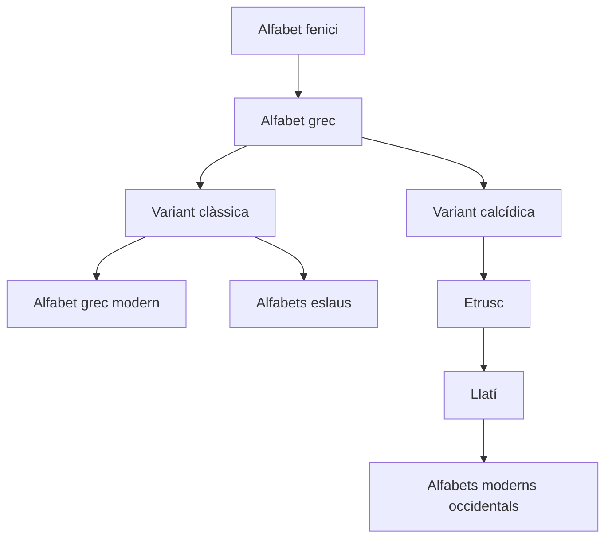

## 🏛️ Del grec al llatí i a altres alfabets

L’**alfabet grec** és la base de l’**alfabet llatí**. Els grecs el van introduir a les seues colònies del sud de la península Itàlica (*Magna Grècia*) en època arcaica.

- **Segle VII aC**: els **etruscs**, en contacte amb els grecs, prengueren l’alfabet grec i el modificaren.
- **Segle VI aC**: els **llatins** coneixen aquest alfabet a través dels etruscs i l’adapten a la seua llengua.

---

## 🌍 Expansió dels alfabets

Del grec deriven **molts altres alfabets**, de dues maneres:

- 🔁 **Indirectament** a través del **llatí** (que arriba a tot Occident, Amèrica, Àfrica i Oceania).
- ↩️ **Directament**, com en el cas dels **alfabets eslaus**, que adoptaren les grafies gregues gràcies a l’evangelització de **Ciril i Metodi** (segle IX).

---

## 📈 Diagrama d'evolució de l'alfabet

