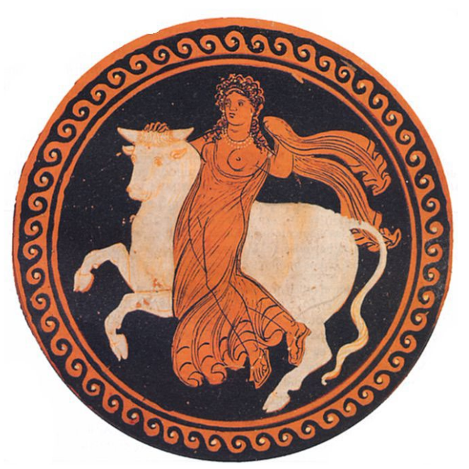

## 🏺 Un poc de mitologia: El rapte d'Europa

Els mites solen explicar fets reals. Així, el **mite d’Europa** explica l’origen **fenici de l’alfabet grec** i de la **monarquia** com a forma de govern a Creta.  
Per això, en la civilització cretenca hi ha contínues referències al **toro**.

---

### 🐂 Zeus i Europa

Zeus, déu suprem de l’Olimp, va mantindre nombroses aventures amoroses al marge de la seua esposa Hera, deessa del matrimoni.  
Una d’elles fou amb Europa.

Europa era una jove princesa fenícia. Un dia, mentre jugava amb les seues serventes a les platges de Tir, passà per allí Zeus i s’enamorà d’ella.  
Per a seduir-la, es transformà en **toro** i s’acostà mansament a la donzella. Europa acaricià l’animal i, confiada, es va pujar damunt del seu llom.

El toro (Zeus) inicià una **fuga veloç**, es llançà al mar i només s’aturà en arribar a l’illa de **Creta**.  
Allí, Europa donà el seu nom a la nova pàtria i tingué **tres fills amb Zeus**, entre ells **Minos**, primer rei de Creta.

> 

---

### 👑 Cadme i l’alfabet grec

Però el mite no acaba ací. El pare d’Europa, rei de **Fenícia**, va manar als seus fills buscar-la per tot el Mediterrani oriental, amb l’ordre de **no tornar sense ella**.

Un dels seus fills, **Cadme**, va arribar a **Grècia** i, com que no la trobà, es va veure obligat a quedar-s’hi.  
El príncep fenici fundà la ciutat de **Tebes** i **ensenyà als grecs l’alfabet**.

---

> *«Eixos fenicis que arribaren junt amb Cadme, d’entre els quals estaven els jefes, i que en arribar a terra, ensenyaren als grecs moltes arts d’aprenentatge; i precisament de l’alfabet, que abans no existia, segons jo crec, entre els grecs.  
> Al principi les lletres eren com les que usaven els fenicis; però amb el temps, canviaren la forma i també el so d’algunes.  
> En els regnes jònics, on les usaven més, i com que havien sigut introduïdes pels fenicis, s’anomenaren “lletres fenícies”.»*  
> — **Heròdot**, *Història*, V, 58.
